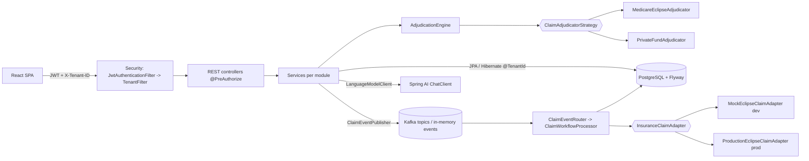

# AustraCare MBS Pro

**Hospital Billing & Clinical Engine** for Australian hospitals.


AustraCare is a multi-hospital billing and insurance-claims platform for Australian hospitals:
patients, admissions and beds, doctors, pathology, pharmacy, itemised AUD billing with GST,
**Medicare (MBS 75%) + private health fund adjudication**, and a full **claims lifecycle**
(DRAFT -> ... -> RECONCILED) with an Explanation of Benefits.

Every screen is wired to the Spring Boot API and PostgreSQL - nothing is mocked:

- **Sign-in and self-registration.** Pick a role (Receptionist, Doctor, Billing Officer, Admin), get a JWT, and routes are guarded by role.
- **Beds.** Admission uses a live bed picker. Beds move AVAILABLE -> OCCUPIED on admission and back to AVAILABLE on discharge; UNDER_MAINTENANCE beds are never offered.
- **Clinical records per admission.** Consultations follow the doctor's weekly roster, and lab orders (MBS codes) and prescriptions are linked to the admission.
- **Discharge.** It works out the length of stay, bills room rate x days, runs Medicare / fund adjudication and **locks the bill lines**.
- **Medicare rebates.** 75% in-patient (IPD), 85% out-patient (OPD), 100% public, 0% on accommodation and pharmacy.
- **GST.** 0% on clinical services.
- **Patient payment status.** PENDING / PARTIAL / FULL.
- **Lab and pharmacy work queues.** Doctors order tests and prescribe from the admission. The Laboratory "Incoming queue" and the Pharmacy "Incoming prescriptions" pick the orders up. Every step records who did it and when (ordered by, collected by, performed by, result notes, dispensed by, and a stock ledger).
- **Live bill.** Lab orders, dispensed medicines, consultations and bed moves update the admission's draft bill straight away, with MBS item, GST and rebates.
- **GST-classified catalogues.** MBS pathology and imaging are GST-free. Medicines are PBS or prescription (GST-free), or OTC or other goods (10%). The GST rate follows the category, so it can't be mis-keyed.
- **Automatic claims.** Finalising a bill creates the Medicare (ECLIPSE) claim and the health fund claim; what's left is the patient gap.
- **Download Tax Invoice PDF.** An A4 tax invoice and discharge summary with the hospital letterhead (ABN), the Medicare card and IRN, stay dates, an itemised breakdown, rebates, total due, amount paid and the remaining balance.

| Layer | Technology |
|---|---|
| Backend | Java 21, Spring Boot 3.5, Spring Data JPA / Hibernate 6.6, Spring Security (JWT), Flyway, PostgreSQL 16 |
| Messaging | Spring Kafka (KRaft) - or in-memory Spring events when Kafka is not running |
| Caching | Spring Cache (in-memory, or Redis with the `redis` profile) |
| Frontend | React 19, Vite 7, Tailwind CSS, React Router 7, Axios, lucide-react |
| AI | Spring AI 1.1 (OpenAI-compatible) - MBS coding assistant, bill explanation, claim risk review |
| Security | Spring Security 6, stateless JWT (HS384), role-based `@PreAuthorize`, logout / token revocation |
| DevOps | Docker (multi-stage images, nginx), Docker Compose, GitHub Actions CI/CD to GHCR + SSH deploy |
| Quality | 40 JUnit 5 unit tests, RFC 7807 errors, OpenAPI / Swagger UI, Dependabot |

---

## 1. Run it in IntelliJ IDEA (5 minutes)

### Prerequisites
- **JDK 21** (IntelliJ: *File > Project Structure > SDK > Add SDK > Download JDK > 21*)
- **Node.js 20 or 22 LTS** (https://nodejs.org)
- **PostgreSQL 16** running locally - or Docker: `docker compose up -d`

### Step 1 - Database
Create an empty database (Flyway creates all tables, indexes and demo data on first start):
```sql
CREATE DATABASE hospital_billing;
```
Defaults: `localhost:5432`, user `postgres`, password `postgres`.
If yours differ, edit the environment variables in the run configuration
(*Run > Edit Configurations > Backend (Spring Boot) > Environment variables*):
`DB_URL`, `DB_USERNAME`, `DB_PASSWORD`.

### Step 2 - Open the project
*File > Open >* select the **root folder** `australia-hospital-billing` > *Trust project*.
IntelliJ imports the Maven backend automatically (wait for the dependency download to finish).
Enable Lombok if asked (*Settings > Build > Compiler > Annotation Processors > Enable*).

### Step 3 - Start the backend
Choose run configuration **Backend (Spring Boot)** (top-right) and press Run.
Wait for `Started HospitalBillingApplication`. API: http://localhost:8080 - Swagger: http://localhost:8080/swagger-ui.html

### Step 4 - Start the frontend
- **IntelliJ Ultimate:** run **Frontend (npm run dev)** (or **Full stack** to start both at once).
- **IntelliJ Community:** open the *Terminal* tab and run:
  ```bash
  cd frontend
  npm install
  npm run dev
  ```
Open **http://localhost:5173**. Vite proxies `/api` to the backend, so there are no CORS issues in development.

From a terminal instead of IntelliJ:
```bash
# terminal 1 - backend (the wrapper downloads Maven if you do not have it)
cd backend
./mvnw clean spring-boot:run          # Windows: mvnw.cmd clean spring-boot:run
#   or, with Maven installed:  mvn clean spring-boot:run   (works from the root folder too)
#   custom DB password:        DB_PASSWORD=secret ./mvnw clean spring-boot:run

# terminal 2 - frontend
cd frontend
npm install
npm run dev
```

> Upgrading from an earlier copy of this project? Just start the backend: Flyway applies
> `V4__clinical_workflow_and_invoicing.sql` to your existing database (it renames the BILLING role to
> BILLING_OFFICER and MAINTENANCE beds to UNDER_MAINTENANCE, and adds schedules, consultations and invoice
> columns). Sign out and in again so your browser gets a token with the new role name.

### Demo logins (Sydney Harbour Private Hospital)
| Username | Password | Can do |
|---|---|---|
| admin | Admin@123 | everything |
| billing | Billing@123 | Billing Officer: bills, payments, claims, tax invoices |
| doctor | Doctor@123 | admit, lab orders, prescriptions |
| reception | Reception@123 | register patients, admit, beds |
| lab | Lab@123 | Lab Technician: lab queue, results, test catalogue |
| pharmacy | Pharmacy@123 | Pharmacist: dispensing queue, formulary, stock ledger |

`melb.admin / Admin@123` signs in to **Melbourne General** and sees only Melbourne data (tenant isolation).

Or click **Create account** on the sign-in screen: choose the hospital, a role (Receptionist, Doctor,
Billing Officer, Administrator) and a password (8+ characters, upper and lower case, number, symbol).
The account is stored with a BCrypt hash and you are signed straight in. Production (`prod` profile)
turns self-registration off with `REGISTRATION_ENABLED=false`.

---

## 2. End-to-end demo script (what to show in an interview)
1. **Create account** as a Receptionist (or sign in as `reception`) > Patients > **Register patient**:
   the form checks the Medicare check digit, the IRN, a past DOB and an Australian phone number before sending.
2. Patients > *Emily Johnson* (Bupa GOLD, no-gap) > **Admit** > *In-patient (IPD)*: pick a bed from the live
   AVAILABLE list. Rooms & Beds now shows it **OCCUPIED**.
3. **doctor** > Admission page > **Consultation** (Dr Priya Sharma, specialist review; "In session" when
   inside her roster from *Doctor Schedules*), **Order lab** (FBC + Troponin, MBS items) and **Prescribe** (Paracetamol).
4. **lab** > Laboratory > *Incoming queue* > open the order > **Mark collected**, enter results, **Complete & sign off**
   (the collector, performer and result notes are recorded). **pharmacy** > Pharmacy > *Incoming prescriptions* > **Dispense**
   (stock is deducted in the ledger, and the lines appear on the draft bill at once; only dispensed medicines are billed).
5. Admission page > **Discharge**: the dialog previews stay days x rate. On confirm the bed goes back to
   **AVAILABLE**, the bill is generated automatically and every clinical line is **locked**.
6. **billing** (Billing Officer) > **Open bill**: room / consultation / lab / pharmacy subtotals, the
   **Medicare 75% / Bupa / patient split**, payment status **Payment pending**. Click **Download Tax Invoice PDF**.
   Optional: *Add line* > EQUIPMENT to see the fund reject a line later.
7. Repeat with an **Out-patient (OPD)** visit (no bed): Medicare pays **85%** of the MBS fee and the fund pays nothing
   (funds cannot cover out-of-hospital medical services). A *Public* patient is 100% funded.
8. **Finalise & create claims**: the Medicare (ECLIPSE) claim and the Bupa claim are created automatically.
9. Claim > **Validate** > **Submit to payer**. Watch the status history fill in by itself:
   SUBMISSION_QUEUED > SUBMITTED > ACKNOWLEDGED > ACCEPTED > PAID > RECONCILED, a remittance payment
   appears on the bill, and an **Explanation of Benefits** is issued.
10. Bill > **Record payment**: part of the gap gives **Part paid** (PARTIAL), the rest gives **Paid in full** (FULL).
    Download the tax invoice again: amount paid and balance remaining are updated.
11. **Spring AI**: Bill > **Explain bill**; Bill (draft) > *Add line* > **Suggest MBS items** from notes;
   Claim > **Risk review**. The badge shows whether the answer came from the model or the rule-based fallback.
12. Sign out: the JWT is revoked on the server; reusing it returns 401.

Try also: *William Brown* (Medibank, known-gap cap $500), *Aisha Khan* (HCF, non-participating: bigger gap),
*Lucas Martin* (lapsed policy: Medicare only), and the `backend/api-demo.http` file in IntelliJ.

---

## 3. Architecture



**Modular monolith** - one deployable, one package per bounded context:
`patient`, `provider`, `admission` (rooms/beds), `lab`, `pharmacy`, `insurance`, `billing`,
`adjudication`, `claim`, `notification`, plus cross-cutting `tenant`, `security`, `common`.

### Multi-tenancy (row level)
- `TenantContext` - `ThreadLocal<UUID>`, always cleared in `finally`.
- `TenantFilter` - validates `X-Tenant-ID`; for signed-in users the tenant comes from the **signed JWT**, and a different header is rejected with 403.
- `BaseTenantEntity` - Hibernate 6 `@TenantId`: every INSERT gets `tenant_id`, every query gets `WHERE tenant_id = ?` automatically, including derived queries and lazy loads.
- Async consumers bind the tenant from the event (`TenantContext.runAs`) **before** the transaction opens.
- Cache keys include the tenant id (a classic multi-tenant leak otherwise).

### SOLID where it matters
| Principle | Where |
|---|---|
| SRP | `AdjudicationEngine` only splits money; `ClaimValidator`, `GstCalculator`, `CoverageResolver`, `EobService` each do one job |
| OCP | `ClaimAdjudicatorStrategy` (new payer = new bean); `ChargeCollector` (new charge source = new bean) |
| LSP / DIP | `InsuranceClaimAdapter` with mock/production implementations chosen by Spring profile; `ClaimEventPublisher` with Kafka/in-memory implementations |
| ISP | `AdmissionReadOperations`, `AdmissionLifecycleOperations`, `BedAllocationOperations` - billing/lab/pharmacy depend on read-only ops |

### Adjudication rules (simplified, documented in code)
- **Medicare**: 75% of the MBS schedule fee for in-patient (IPD) medical services, **85% for out-patient (OPD)**
  services (private patients); public patients fully funded (100%); **0% on accommodation and pharmacy**.
- **Private fund** (in-patients only - funds may not pay out-of-hospital medical services): 25% of the schedule fee + the part above it depending on the hospital agreement
  (NO_GAP = all, KNOWN_GAP = all but a capped gap, NON_PARTICIPATING = none); accommodation/nursing/equipment
  and pharmacy by cover tier (Basic -> Gold, with Plus variants); excess deducted; capped by the annual-limit accumulator.
- **Patient gap** = Net - Medicare - Fund (ER note 4). GST 10% only on taxable supplies; medical services and accommodation are GST-free.
- **Bill = Room (rate x days) + Consultations + Lab + Pharmacy (+ manual lines)**. Days = every started 24 h, minimum 1.
- **Discharge** publishes `AdmissionDischargedEvent`; `DischargeBillingListener` (same transaction) costs the stay and
  locks the lines, so a patient can never be discharged with a half-built bill, and admission code does not depend on billing.
- **Payment status** (patient share): PENDING (nothing paid), PARTIAL, FULL (patient share settled; a fully funded public patient is FULL once finalised).

### Claims lifecycle (event driven)
`DRAFT -> VALIDATED -> SUBMISSION_QUEUED -> SUBMITTED -> ACKNOWLEDGED -> ACCEPTED/REJECTED -> PAID -> RECONCILED -> CLOSED`

Topics: `claim.submitted`, `claim.adjudicated`, `claim.rejected`, `remittance.posted`, `notification.dispatch` (+ `.DLT` dead-letter topics).
Handlers are idempotent (Kafka is at-least-once), use exponential back-off for payer calls, never hold a DB
transaction open while calling the payer, and publish only after commit.

### Database
Flyway migrations in `backend/src/main/resources/db/migration`:
- `V1` schema matching the ER diagram (the ER's `LAB_BILL` is folded into `BILL_ITEM` rows of type LAB, so one invoice/claim covers everything);
- `V2` indexes: composite tenant indexes, an index on every foreign key, and a temporal index plus a
  **PostgreSQL exclusion constraint** that makes double-booking a bed impossible even under race conditions;
- `V3` demo data for two hospitals;
- `V5` lab/pharmacy workflow: test type, GST flag and active flag on `lab_test`; audit columns on `lab_order`,
  `lab_order_item` and `pharmacy_prescription`; GST `supply_category` on `medicine` (with a CHECK that the
  rate matches); a `medicine_stock_movement` ledger; queue indexes; and a standard test catalogue and formulary for
  **every** hospital (FBC 65070, EUC 66500, Lipid 66503, Chest X-Ray 58503, Troponin, ECG). The MBS numbers and fees
  are demo values: check them against MBS Online before real use;
- `V4` clinical workflow: IPD/OPD care setting, `doctor_schedule`, `consultation`, locked bill lines,
  `payment_status`, hospital letterhead, BILLING_OFFICER role and UNDER_MAINTENANCE bed status (with CHECK constraints).

### Errors (RFC 7807)
Every error - validation, business rule, security, tenant - has the same JSON shape:
```json
{ "type": "https://api.hospital-billing.example/errors/validation-failed", "title": "Validation failed",
  "status": 400, "detail": "...", "instance": "/api/v1/patients", "timestamp": "...",
  "errorCode": "VALIDATION_FAILED", "message": "...", "correlationId": "...",
  "details": [{ "field": "medicareNo", "message": "is not a valid Medicare card number" }] }
```

---

## 4. Security (JWT + Spring Security)
1. `POST /api/v1/auth/login` (with `X-Tenant-ID` = chosen hospital) checks the BCrypt password and returns a signed JWT
   containing user id, **tenant id**, role and a unique token id (`jti`).
   `POST /api/v1/auth/register` creates a user for the chosen hospital (usernames and emails unique across all
   hospitals, password policy, role limited to `app.security.registration.allowed-roles`) and returns a JWT too.
2. `JwtAuthenticationFilter` verifies the signature and expiry on every request - no session, no DB call.
3. `TenantFilter` binds the tenant from the token (a mismatching `X-Tenant-ID` header -> 403).
4. `@PreAuthorize("hasRole('ADMIN') or hasRole('BILLING_OFFICER')")` etc. on controllers; roles: ADMIN, BILLING_OFFICER, DOCTOR,
   RECEPTIONIST, LAB, PHARMACY. The React router mirrors the rules (`auth/roles.js`) so users only see what they may do.
5. `POST /api/v1/auth/logout` revokes the token's `jti` until it expires (`TokenRevocationService`; move it to Redis when running several instances).
6. 401/403 responses use the same RFC 7807 body; CORS is restricted to the configured frontend origins; secrets come from env vars.

## 5. Spring AI features
AI is **off by default** (`AI_ENABLED=false`), and every feature then uses a deterministic fallback, so the app always works.
To switch it on, set these environment variables in the IntelliJ run configuration (or `.env` for Docker):
```
AI_ENABLED=true
OPENAI_API_KEY=sk-...
OPENAI_MODEL=gpt-4o-mini            # optional
OPENAI_BASE_URL=https://api.openai.com   # or any OpenAI-compatible API (Azure OpenAI, Groq, Ollama /v1)
```
| Module | Feature | Endpoint | Fallback |
|---|---|---|---|
| Billing / clinical coding | Suggest MBS items from clinical notes (structured output -> records) | `POST /api/v1/coding/mbs-suggestions` | keyword rule table |
| Billing | Plain-English bill explanation for the patient | `GET /api/v1/bills/{id}/ai-explanation` | template |
| Claims | Pre-submission denial-risk review | `GET /api/v1/claims/{id}/ai-review` | validator + heuristics |

Design choices worth explaining in an interview:
- **`LanguageModelClient` interface** (DIP): modules never import Spring AI; tests use a fake model.
- **Structured output**: `chatClient.prompt()...call().entity(Record.class)`; answers are sanitised (max items, valid enums, confidence 0-1).
- **Privacy**: prompts are de-identified - no patient names/MRN/Medicare numbers; free text goes through `PiiRedactor`.
- **AI assists, rules decide**: the claim review can raise but never lower the rule-based risk, and money is never calculated by the model.
- **Resilience**: any AI error or timeout returns the fallback; the UI shows whether an answer is "AI" or "Rule-based".

## 6. Docker
```bash
cp .env.example .env                               # optional: secrets, AI key
docker compose --profile app up -d --build         # PostgreSQL + backend + frontend
```
Open **http://localhost:3000** (nginx serves React and proxies `/api` to Spring Boot). Add `--profile kafka --profile redis`
and `BACKEND_PROFILES=kafka,redis` in `.env` for the event-driven setup.
- `backend/Dockerfile`: Maven build stage -> Spring Boot **layered** jar on a JRE 21 Alpine image, non-root user, health check.
- `frontend/Dockerfile`: Node build stage -> nginx with SPA fallback, asset caching and security headers.
- `docker-compose.prod.yml`: runs the images published by the pipeline (used by the deploy job).

## 7. CI/CD (GitHub Actions - `.github/workflows/ci-cd.yml`)
| Stage | When | What |
|---|---|---|
| Backend | every push / PR | JDK 21, `./mvnw verify` (compile + unit tests), test reports uploaded |
| Frontend | every push / PR | `npm ci`, lint, production build |
| Docker | after both pass | builds both images (layer cache); on `main` pushes to `ghcr.io/<owner>/hospital-billing-*:latest` and `:<sha>` |
| Deploy | `main`, when repo variable `DEPLOY_ENABLED=true` | manual approval via the `production` environment, SSH to the server, `docker compose pull && up -d`, smoke test |

Deploy secrets: `DEPLOY_HOST`, `DEPLOY_USER`, `DEPLOY_SSH_KEY`; the server keeps its own `.env` (DB password, JWT secret, AI key).
Dependabot keeps Maven, npm, Docker and Actions dependencies up to date.

## 8. Optional: Kafka and Redis
```bash
docker compose --profile kafka --profile redis up -d
```
Then run **Backend (Kafka + Redis)** (`--spring.profiles.active=kafka,redis`).
Kafka UI: http://localhost:8090 - watch the claim events flow through the topics.
Set `app.claims.mock-adapter.transient-failure-rate: 0.3` to see retries with exponential back-off in the log.

## 9. Tests
```bash
cd backend && ./mvnw test        # or right-click src/test/java > Run 'All Tests' in IntelliJ
```
Unit tests cover the adjudication engine (no-gap, known-gap, non-participating, public, uninsured,
annual limit, OPD 85%), length of stay, discharge locking, FULL/PARTIAL/PENDING payment status, Medicare check digit, claim state machine, bill payments/refunds, GST, bed-day rules,
PII redaction, the MBS coding assistant (fake model + fallback) and JWT revocation.

## 10. Project structure
```
australia-hospital-billing/
├── backend/            Spring Boot (Maven) - src/main/java/com/hospital/billing/<module>/{domain,service,web}
├── frontend/           React + Vite - src/{api,auth,components,pages,hooks,utils}
├── .run/               shared IntelliJ run configurations
├── docker-compose.yml       PostgreSQL; profiles: app (backend+frontend), kafka, redis
├── docker-compose.prod.yml  deployment using the published images
├── .env.example             secrets template (never commit .env)
└── .github/                 CI/CD pipeline + Dependabot
```

## 11. Known simplifications / next steps
- Transactional **Outbox** for exactly-once event publishing (currently publish-after-commit).
- Integration tests with **Testcontainers** (PostgreSQL + Kafka).
- Real ECLIPSE lodgement needs a PRODA B2B certificate; `ProductionEclipseClaimAdapter` shows the integration seam.
- MBS fees and cover-tier percentages in the demo data are illustrative.
- Refresh tokens; move the token revocation list to Redis for multi-instance deployments.
- RAG over the MBS schedule (Spring AI `VectorStore`) so coding suggestions cite the official item text.
